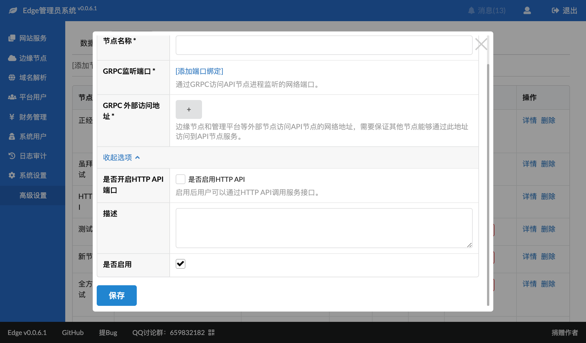
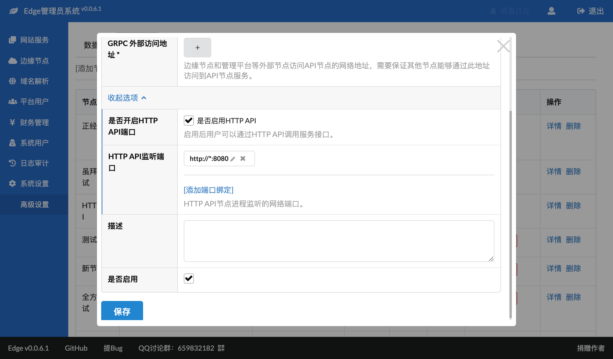

# API节点设置
要想使用HTTP访问API节点服务，需要在API节点上做一些设置。

## 步骤1：修改设置
在修改API节点或者新创建API节点界面中，点击"更多选项"：

选中"是否开启HTTP API端口"后的复选框，并添加一个端口，然后保存即可，类似于：

在这个例子中，我们把HTTP API的端口设置为了8080，当然你也可以设置成80或者443，只要不和其他服务冲突即可。

如果你的系统开启了防火墙，注意在防火墙中放行此端口。

## 步骤2：重启API节点
在修改设置后，可以重启API节点，以便让配置生效，可以在启动日志中观察端口是否启动正常。

## 步骤3：验证端口是否可以访问
可以通过访问：
~~~
http://你的IP:端口
或
https://你的IP:端口
~~~
来验证API是否已经可用，如果可用的话会输出：
~~~json
{"code":200,"data":{},"message":"Welcome to API"}
~~~
