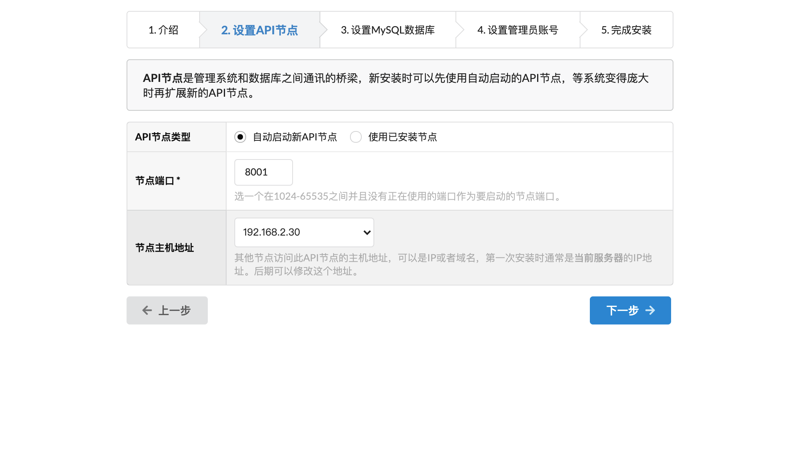

# 安装管理平台
## 准备工作
在安装GoEdge之前，需要你做以下准备工作：
* 安装一个或者使用现有的 MySQL 5.7.x 以上版本；
* Linux服务器需要确认有 `unzip` 命令，用来解压压缩包，可以使用：
  ~~~bash
  unzip
  ~~~
  命令来确认这个命令是否可用。

## 开始安装
1. 在官网下载对应版本的安装压缩包
2. 上传到你的服务器上，并使用`unzip`解压，类似于：
   ~~~
   unzip ./edge-admin-linux-amd64-v0.0.1.zip
   ~~~
   把其中的`v0.0.1`换成实际的版本号；
3. 启动管理平台：
   ~~~bash
   cd edge-admin/
   bin/edge-admin start
   ~~~
4. 如果没有意外的话，服务就正常启动了，并提示类似于以下的信息：
  ~~~
  Edge Admin started ok, pid: 109053
  ~~~
  可以使用`ps`命令，来检查进程是否存在：
  ~~~bash
  ps ax|grep edge
  ~~~
  可以看到类似于以下的进程信息：
  ~~~
  31643 ?        Sl     0:04 bin/edge-admin
  ~~~
  就说明管理平台启动成功；
5. 可以在 `logs/run.log` 中查看启动的日志，方便我们诊断问题；
6. 默认启动的端口是 `7788`，确认进程已经启动的时候，可以在浏览器上通过：
   ~~~
   http://IP地址:7788/
   ~~~
   访问管理平台；如果你的服务器上已经设置了防火墙，需要在防火墙设置 `7788` 这个端口是通过的；
7. 如果能正常访问上述网址的话，系统会自动进入安装过程，按照界面提示填写各项选项即可。

## 安装界面
### 介绍

这一步用于简要介绍Edge的安装界面。

### 设置API节点

这一步用于选择API节点，API节点用于作为系统的多个组件之间通讯的桥梁，如果你以前没有安装过GoEdge，建议选择"自动启动新API节点"，这样系统会自动在本地（即和管理平台一个服务器）启动一个新的API节点，而不需要另外重新安装。

选项说明：
* `节点端口`：选一个在1024-65535之间并且没有正在使用的端口作为要启动的节点端口。如果你的服务器上有防火墙，请记得设置这个端口为通过，这样将来部署在别的服务器上的边缘节点才可以访问。默认为 `8001`，注意检查这个端口有没有被别的进程所占用。
* `节点主机地址`：其他节点访问此API节点的主机地址，可以是IP或者域名，第一次安装时通常是 **当前服务器** 的IP地址。我们提供了对应的管理界面，安装完成后，可以随时修改这个地址。

### 设置MySQL数据库

### 设置管理员账号

可以设置稍微复杂的管理员账号，但请一定要记住这个密码。

### 完成安装

这一步可以确认前面所填写的信息，如果确认无误后，可以点击"确认并开始安装"。

### 安装完成

如果安装过程中没有错误产生的话，会出现以上的界面，点击"确定"按钮即可进入登录界面。

如果出现了错误，请截图发给我们，我们会随时帮助你诊断问题所在。
   