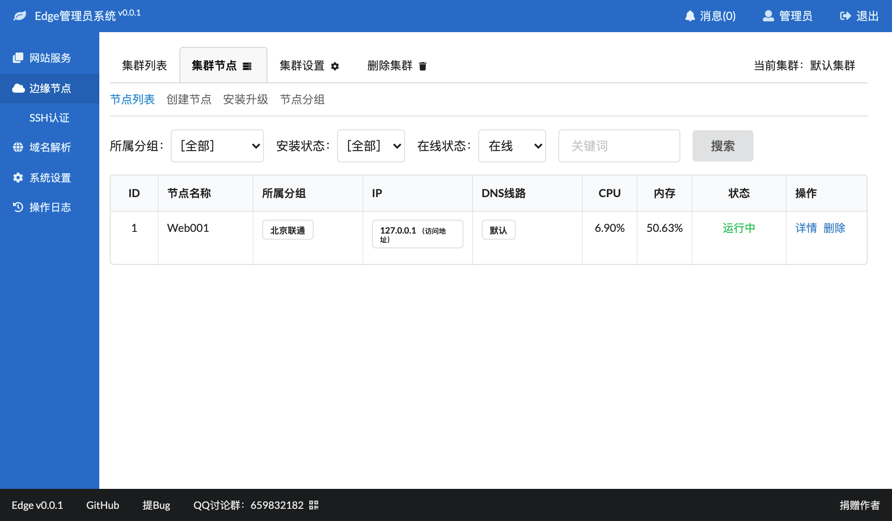

# 自动注册边缘节点
如果使用其他安装方式，都需要手工先在管理平台创建边缘节点，然后才能再安装；而我们提供的自动注册功能，可以方便用户不必每个节点都重新配置一下。

1. 可以在"集群节点" -- "安装升级" -- "自动注册" 界面中查看等待安装的边缘节点；
2. 在"自动注册"界面，可以查看配置文件内容，先不着急使用这个配置文件；
3. 在GoEdge官网上下载对应版本的边缘节点；
4. 上传到目标服务器，然后使用 `unzip` 命令解压，比如：
   ~~~bash
   unzip ./edge-node-linux-amd64-v0.0.1.zip
   ~~~
   如果系统没有 `unzip` 命令，请先安装；
5. 解压后转到安装目录下：
   ~~~bash
   cd edge-node/
   ~~~
   创建配置文件 `cluster.yaml`：
   ~~~bash
   vi configs/cluster.yaml
   ~~~ 
   把 `cluster.yaml` 里面的内容换成在当前流程 第2步 看到的配置内容，然后保存，也可以直接从管理平台下载 `cluster.yaml` 上传；
6. 可以使用以下命令启动节点：
   ~~~bash
   bin/edge-node start
   ~~~
7. 可以使用 `ps` 命令确认进程是否正常启动：
   ~~~
   ps ax|grep edge-node
   ~~~
   应该输入类似于以下的内容：
   ~~~
   52160 ?        Sl     1:42 /opt/www/edge-node/bin/edge-node
   ~~~
8. 如果没有启动成功或者有其他异常，可以通过查看 `logs/run.log` 中的内容来诊断问题所在。   

实际部署过程中，你可以下载 `cluster.yaml`，然后放入到压缩包中的 `configs/` 目录下，以后直接使用这个压缩包，就可以在任何服务器上安装并自动注册新的边缘节点。

## 确认启动状态
可以在单个集群的"集群节点"中查看节点的状态：
   

正常情况下，状态应该为"运行中"。
   
## 注意事项
1. 单个服务器同时只能启动一个边缘节点。