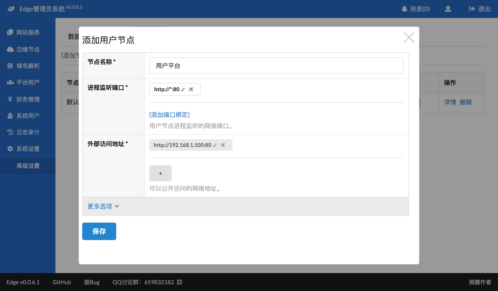

# 安装用户节点
1. 登录管理员系统
2. 在"系统设置" -- "高级设置" -- "用户节点"中点击"添加节点"
   
   如果所示：
   * 平台名称：可以任意填写
   * 进程监听端口：启动用户节点后，进程所监听的端口，通常是HTTP 80或者HTTPS 443，当然也可以使用别的端口
   * 外部访问地址：外部用户可以访问用户节点的地址
3. 点击"保存"后，可点击节点列表中的"详情"，然后点击"安装节点"，此页面会展示接下来的安装步骤和配置信息
4. 在官网下载用户节点程序，通常是类似于"edge-user-linux-amd64-v0.0.1.zip"的文件，上传到你要提供用户访问服务的服务器，然后解压；
5. 按照步骤 3 中的页面替换 `configs/api.yaml` 内容；
6. 使用 `bin/edge-user start` 命令启动节点；
7. 可以在logs/run.log中查看启动是否有异常；
8. 如果日志中没有异常，可以在浏览器上访问此节点。

## 负载均衡
可以在不同的服务器上部署多个用户节点，以实现负载均衡或者容灾备份。

## 注意事项
* 需要注意防火墙设置是否允许访问指定的端口。